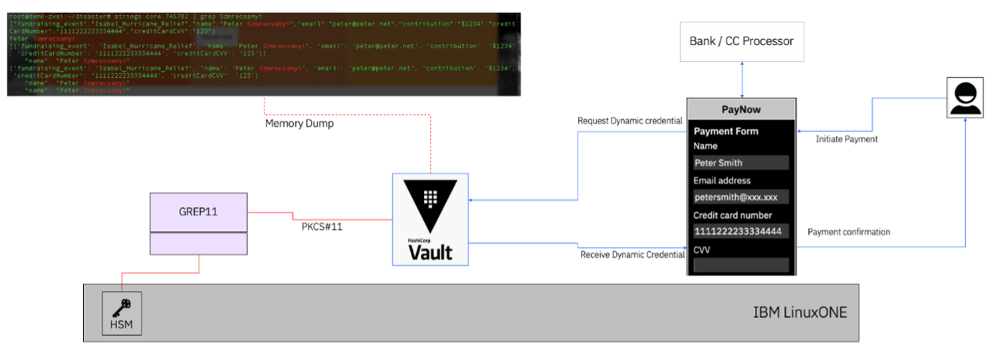
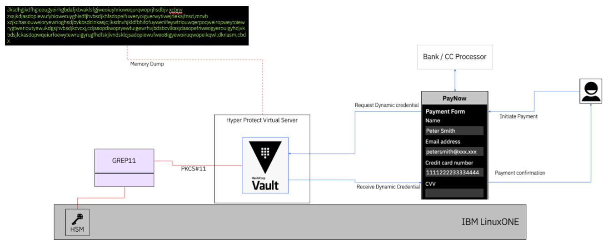

# How to run IBM Vault in a Confidential Computing enclave?

## Introduction
IBM Vault provides a centralized approach to secrets-management across every element of the application delivery lifecycle. It also provides a highly available and secure way of storing and exposing secrets to applications and users, such as encryption keys, API tokens, and database credentials. While Vault is a market leading product in its category, the concentration of enterprise-wide secrets into one entity also makes it a target for "keys to the kingdom" types of attacks, which can put the whole enterprise at risk.

[IBM Hyper Protect Virtual Server (HPVS)](https://www.ibm.com/products/hyper-protect-virtual-servers) is a Confidential Computing enclave on IBM Z LinuxONE and Linux on Z, designed to provide scalable isolation for workloads to protect them from not only external attacks, but also insider threats. Data-in-use protection is achieved by exploiting [Secure Execution](https://www.ibm.com/docs/en/linux-on-systems?utm_source=ibm_developer&utm_content=in_content_link&utm_id=tutorials_awb-protect-data-at-rest-fortanix-ibm-encryption&topic=concepts-secure-execution&cm_sp=ibmdev-_-developer-tutorials-_-ibmcom) for Linux and [Trusted Execution Environments (TEE)](https://en.wikipedia.org/wiki/Trusted_execution_environment), to protect data and the workload interacting with this data, when the application is running and, associated data is loaded into the server’s memory. 

Vault protects its secrets database in storage with a Vault-Master-Key. The Vault-Master-Key can also be protected with a Key-Encryption-Key (KEK) obtained from a Hardware Security Module (HSM) with both [auto-unseal](https://www.vaultproject.io/docs/concepts/seal) and [seal wrapping](https://www.vaultproject.io/docs/enterprise/sealwrap) functions available from Vault.  

However, anything that Vault loads into the server memory is vulnerable to an “insider attack”. A bad actor, with super user access to the server, can do a memory dump and get access to “plain-text” secrets and other PII in the server’s memory.


When Vault is run within Confidential Computing, HPVS ensures that workloads cannot be inspected by a bad-actor or super-user with the ability to do a memory dump, as shown below:


In addition to memory protection, HPVS also makes sure the containerized workload itself is built around an [immutable contract](https://www.ibm.com/docs/en/hpvs/2.2.x?topic=servers-about-contract), which can be encrypted to maintain confidentiality.

This tutorial will be split into three parts:
 1. [Create a containerized image of Vault that accepts configuration via BASE64 encoded env variables](https://github.ibm.com/hyperprotect/zcat/blob/main/tutorials/vault-on-hpvs.md#1-create-a-containerized-image-of-vault-that-accepts-configuration-via-base64-encoded-env-variables)
 2. [Configure an instance Vault to run in HPVS](https://github.ibm.com/hyperprotect/zcat/blob/main/tutorials/vault-on-hpvs.md#2-configure-an-instance-of-vault-to-run-in-hpvs)
 3. [Use the Vault instance running in HPVS to leverage an external HSM (via GREP11) for sealing and unsealing process](https://github.ibm.com/hyperprotect/zcat/blob/main/tutorials/vault-on-hpvs.md#3-configure-vault-to-use-external-hsm-via-grep11-for-sealing-and-unsealing-operations)

## Pre-reqs
- Some knowledge of HPVS (as environment setup such as logging and contract definition will not be covered here)
- Some knowledge of Vault
- Podman will be used instead of Docker, this means using `Containerfile` to build images (these are analogous to `Dockerfile`) and `podman play` yaml files (instead of the tradition `docker-compose.yaml`)
- Access to an s390x server / VSI on a LinuxONE to build images (it's possible to cross build for s390x, but this is not in scope for this tutorial)
- Access to a container registry (in the sample outputs you will see they we use IBM Cloud Container Registry (ICR) - `us.icr.io`)
- Vault license (trial license can be obtained from Hashicorp)
- Access to a GREP11 container running with PKCS11 capability (analogous to Hyper Protect Crypto Service on IBM Cloud with EP11 endpoints).

## 1. Create a containerized image of Vault that accepts configuration via BASE64 encoded env variables
HPVS needs a **containerized image** of the workload in question (in this case Vault), so as a first step, we will build a containerized workload image, with **configuration files**, to maintain more flexibility we will create these configuration files, with BASE64 encoded environment variables. This will enable us to reuse these images and the associated HPVS contract without the need to rebuild the image and/or archive to include updated configuration files.

### Step 1.1 - Create and Push the Image
- Login into s390x Linux VSI, create an empty directory and change into it, this will be you working directory to build the Vault image.
- Copy the following vault startup script [`vault_script.sh`](configuration-files/vault_script.sh) into this directory, this scripts will create the required configuration files from BASE64 encoded files and start vault.
- Copy the following [`Containerfile`](configuration-files/Containerfile) that creates a `/vault/data` directory for RAFT, downloads the latest Vault binary for s390x **(be sure to check online and update the link as needed)** and copies the vault_script.sh script to the image (so make sure vault_script.sh is in the same directory)
- Build the image with the command `podman build . --tag {registry}/{image-name}:{version}` be sure to sub in the registry, image name and version that you'd like to use (see sample output [here](configuration-files/vault-build-sample-output.txt)).
- Push the image with command `podman push {registry}/{image-name}:{version}`

### Step 1.2 - Get Image URL with SHA256SUM
Check with the registry the image's SHA-256 digest (as this is needed by HPVS):
```
{registry}/{image-name}@sha256:{sha256sum-chars}
```
See sample for ICR - [`us.icr.io/zcat-hashicorp/vault-ent-nohsm@sha256:f8c048a666a45ae1d124150673227c04e2e6c1f890ffaafe62724bd3f58a0367`](configuration-files/ICR-sample.png)

### Step 1.3 - Get the ENV Variables
Copy the vault configuration file [`vault-conf.hcl`](configuration-files/vault-conf.hcl) into the working directory (this file tells Vault to: bring up the UI, listen on `http://0.0.0.0:8200`, use license file `/vault/license.hclic` and use `raft` for storage on path `/vault/data`) and convert this into base64 format as follows:
```
base64 -iw0 vault-conf.hcl
```
The output should look like this:
```
dWkgICAgICAgICAgICA9IHRydWUKY2x1c3Rlcl9hZGRyICA9ICJodHRwOi8vMTI3LjAuMC4xOjgyMDEiCmFwaV9hZGRyICAgICAgPSAiaHR0cDovLzAuMC4wLjA6ODIwMCIKZGlzYWJsZV9tbG9jayA9IHRydWUKbGljZW5zZV9wYXRoICA9ICIvdmF1bHQvbGljZW5zZS5oY2xpYyIKCnN0b3JhZ2UgInJhZnQiIHsKICAgIHBhdGggPSAiL3ZhdWx0L2RhdGEiCiAgICB2YXVsdF9ub2RlX25hbWUgPSAidmF1bHRfMSIgICAgICAgICAgICAjc2V0dGluZyB1cCBhIHVuaXF1ZSBub2RlX2lkIGZvciBlYWNoIHZhdWx0IG5vZGUKfQoKbGlzdGVuZXIgInRjcCIgewogIGFkZHJlc3MgICAgICAgPSAiMC4wLjAuMDo4MjAwIgogIHRsc19kaXNhYmxlICAgPSAxCn0K
```
This will be used in the contract as the `conf` env variable.

Repeat this process for your license to be used as a `license` env variable.

### (Optional) Step 1.4 - Create a `podman play` File to Test Outside of HPVS
Create/copy [`vault.yaml`](configuration-files/vault.yaml), which will be used as a podman play file with the base64 values for `vault-conf.hcl` and your license.

Start the kube with this command:
```
podman play kube vault.yaml
```
Check the sample output in [vault-podman-play-kube-sample-output](configuration-files/vault-podman-play-kube-sample-output).

Test if the vault image comes up with the following commands:
```
export VAULT_ADDR=http://127.0.0.1:8200/
./vault status
```
Check the sample output in [vault-status-sample-output](configuration-files/vault-status-sample-output).

To check the logs, use the command `podman logs {pod ID or container ID}` with the sample output in [vault-podman-log-sample-output](configuration-files/vault-podman-log-sample-output)

## 2. Configure an Instance of Vault to run in HPVS
We will be creating/defining only the workload section of the contract, it's assumed that you have a working env section.

### Step 2.1 - Define Workload Part of Contract and Start HPVS Guest
Define the workload section of the contract [`workload.yaml`](configuration-files/workload.yaml) as follows:
```
type: workload
play:
  templates:
    - apiVersion: v1
      kind: Pod
      metadata:
        name: zcatvault
      spec:
        securityContext:
          privileged: false
        containers:
        - name: {Prefix}vault
          image: {registry}/{image-name}@sha256:{sha256sum-chars}
          securityContext:
            privileged: false
          volumeMounts:
          - name: vault-data
            mountPath: /vault/data
          env:
          - name: conf
            value: dWkgICAgICAgICAgICA9IHRydWUKY2x1c3Rlcl9hZGRyICA9ICJodHRwOi8vMTI3LjAuMC4xOjgyMDEiCmFwaV9hZGRyICAgICAgPSAiaHR0cDovLzAuMC4wLjA6ODIwMCIKZGlzYWJsZV9tbG9jayA9IHRydWUKbGljZW5zZV9wYXRoICA9ICIvdmF1bHQvbGljZW5zZS5oY2xpYyIKCnN0b3JhZ2UgInJhZnQiIHsKICAgIHBhdGggPSAiL3ZhdWx0L2RhdGEiCiAgICB2YXVsdF9ub2RlX25hbWUgPSAidmF1bHRfMSIgICAgICAgICAgICAjc2V0dGluZyB1cCBhIHVuaXF1ZSBub2RlX2lkIGZvciBlYWNoIHZhdWx0IG5vZGUKfQoKbGlzdGVuZXIgInRjcCIgewogIGFkZHJlc3MgICAgICAgPSAiMC4wLjAuMDo4MjAwIgogIHRsc19kaXNhYmxlICAgPSAxCn0K
          - name: license
            value: **omitted**
          ports:
          - containerPort: 8200
            hostPort: 8200
        volumes:
        - name: vault-data
          hostPath:
            path: /mnt/data
            type: DirectoryOrCreate
        restartPolicy: Never
volumes:
  test:
    mount: "/mnt/data"
    seed: "testing"
auths:
  {registry}:
    password: {Registry-Password}
    username: {Registry-User}
```
Remember to update:
- `{Prefix}` with any prefix you would like to use (`zcat` in my case)
- `{registry}` with the registry you are using (`us.icr.io` in my case for ICR)
- `{image-name}` with the image name and path you are using (`zcat-hashicorp/vault-ent-nohsm` in my case for ICR)
- `{sha256sum-chars}` for your image sha-256 value of image (`f8c048a666a45ae1d124150673227c04e2e6c1f890ffaafe62724bd3f58a0367` in my case for ICR)
- And the authentication for you registry in the `auths:` section.
- BASE64 value of `vault-conf.hcl` for the `conf` variable
- BASE64 value of vault license for the `license` variable

Start your HPVS guest (sample on-prem output [here](configuration-files/vault-hpvs-start-sample-output.txt)) and the logs should show that Vault started successfully (sample logging output [here](configuration-files/vault-hpvs-start-sample-output)).

### Step 2.3 - Test by Performing Vault Operations
- Check `vault status` (in my case the HPVS IP is `192.168.122.22`, alter this as needed for your environment):
```
export VAULT_ADDR=http://192.168.122.22:8200/
./vault status
```
The output should look like [vault-hpvs-sample-output](configuration-files/vault-hpvs-sample-output).

- Unseal vault
```
./vault operator unseal
```
The output should look like [vault-hpvs-unseal-sample-output](configuration-files/vault-hpvs-unseal-sample-output) and the expected logs like this [vault-hpvs-unseal-log-sample-output](configuration-files/vault-hpvs-unseal-log-sample-output).

## 3. Configure Vault to Use External HSM (via GREP11) for Sealing and Unsealing Operations

For this you will need a working GREP11 container with database store. To connect to a GREP11 container you will need the following:
 - Hostname, IP or URL
 - Port number (usually `9876`)
 - CA certificate `grep11-ca.pem`
 - Client certificate `grep11-client.pem` (signed by the above CA)
 - Client key for the above client certificate `grep11-client.key`

> Alternatively, if you don't have access to an on-prem GREP11 container, you can use [IBM Cloud Hyper Protect Crypto Services](https://www.ibm.com/products/hyper-protect-crypto) HPCS, however, in this case the configuration file below `grep11client.yaml` used by the [PKCS#11 library](https://github.com/IBM-Cloud/hpcs-pkcs11) will be different. Please follow the online documentation to configure the library to connect to HPCS.

### Step 3.1 - Build Image with HSM Vault Binary and PKCS#11 Library
- Login into s390x Linux VSI, create another empty directory and change into it, this will be you working directory to build the HSM capable image.
- Copy the following **NEW** vault startup script [`vault_script.sh`](configuration-files/vault_script_pkcs11.sh) into this directory, this script will create the required configuration files from BASE64 encoded files for PKCS#11 library and Vault and then start Vault.
- Copy the following **NEW** [`Containerfile`](configuration-files/Containerfile_hsm) that creates a `/vault/data` directory for RAFT, downloads the latest Vault and PKCS#11 library binary for s390x **(be sure to check online and update the link as needed)** and copies the vault_script.sh script to the image (so make sure vault_script.sh is in the same directory)
- Build the image with the command `podman build . --tag {registry}/{image-name}:{version}` be sure to sub in the registry, image name and version that you'd like to use (see sample output [here](configuration-files/vault-build-hsm-sample-output.txt))
- Push the image with command `podman push {registry}/{image-name}:{version}` and make a note of the full image path with SHA256SUM to be used in the HPVS contract later.

### Step 3.2 - Configuration Files
- The [`grep11client.yaml`](configuration-files/grep11client.yaml) is the configuration file for the PCKS#11 Library and should be as follows:
```
iamcredentialtemplate: &defaultiamcredential
          enabled: false
          endpoint: "https://iam.cloud.ibm.com"

sessionauthtemplate: &defaultsessionauth
  enabled: false
  tokenspaceIDPassword: "12345678"

tokens:
  0:
    grep11connection:
      address: "{GREP11-Addr}"
      port: "9876"
      tls:
        enabled: true
        mutual: true
        cacert: "/etc/ep11client/certs/grep11-ca.pem"
        certfile: "/etc/ep11client/certs/grep11-client.pem"
        keyfile: "/etc/ep11client/certs/grep11-client.key"
    storage:
#      filestore:
#        enabled: true
#        storagepath: <GREP11-KeyStore>
      remotestore:
        enabled: true
      # localpostgres:
      #   enabled: false
      #   connectionstring:
    users:
      0: # SO User
        name: "SO user"
      1: # User
        name: "Normal user"
        tokenspaceID: "21DCABAA-BEC7-442A-8089-5BD9582CB7EB"
      2: # Anonymous user
        name: "Anonymous"
        tokenspaceID: "B77CB96E-1D40-4530-8AA4-F96DDBEECD04"
logging:
  loglevel: "trace"
  logpath: "/etc/ep11client/pkcs11.log"
```
Note that you must substitute in the GREP11 IP Address or URL/hostname into `{GREP11-Addr}` and also change the port value below that if different from the standard `9876`, lastly `tokenspaceIDPassword: "12345678"` must contain an 8 digit numeric password than can be changed here, but must also match the password in the vault configuration file below. Lastly, the `tokenspaceID:` values are random UUID values that should be different for every new deployment, so be sure to change if deploying a second vault talking to the same GREP11/HPCS instance.

- The [`vault-conf.hcl`](configuration-files/vault-hsm-conf.hcl) is the configuration file Vault with HSM and should be as follows:
```
ui            = true
cluster_addr  = "http://127.0.0.1:8201/"
api_addr      = "http://0.0.0.0:8200/"
disable_mlock = true
license_path  = "/vault/license.hclic"

storage "raft" {
    path = "/vault/data"
    vault_node_name = "vault_1"            #setting up a unique node_id for each vault node
}

listener "tcp" {
  address       = "0.0.0.0:8200"
  tls_disable   = 1
}

seal "pkcs11" {
 key_label = "vault-hsm-key"
 lib = "/usr/local/lib/pkcs11-grep11-s390x.so.2.6.8"
 slot = "0"
 mechanism = 0x1085
 pin = "12345678"
 generate_key = "true"
 # token_label = "vaultpoc"
 hmac_key_label = "vault-hsm-hmac-key"
}
```
Note that if you altered the `tokenspaceIDPassword: "12345678"` in the PKCS#11 Library configuration file, you must put the matching 8 digits into the `pin` field above.

### Step 3.3 - Define Workload Part of Contract for HPVS
Define the workload section of the contract [`workload.yaml`](configuration-files/workload-hsm.yaml) as follows:
```
type: workload
play:
  templates:
    - apiVersion: v1
      kind: Pod
      metadata:
        name: zcatvault
      spec:
        securityContext:
          privileged: false
        containers:
        - name: {Prefix}vault
          image: {registry}/{image-name}@sha256:{sha256sum-chars}
          securityContext:
            privileged: false
          volumeMounts:
          - name: vault-data
            mountPath: /vault/data
          env:
          - name: grep11
            value: {BASE64 of grep11client.yaml}
          - name: ca
            value: {BASE64 of grep11-ca.pem}
          - name: client
            value: {BASE64 of grep11-client.pem}
          - name: key
            value: {BASE64 of grep11-client.key}
          - name: conf
            value: {BASE64 of vault-conf.hcl}
          - name: license
            value: {BASE64 of license}
          ports:
          - containerPort: 8200
            hostPort: 8200
        volumes:
        - name: vault-data
          hostPath:
            path: /mnt/data
            type: DirectoryOrCreate
        restartPolicy: Never
volumes:
  test:
    mount: "/mnt/data"
    seed: "testing"
auths:
  {registry}:
    password: {Registry-Password}
    username: {Registry-User}
```
Again remember to update:
- `{Prefix}` with any prefix you would like to use
- `{registry}` with the registry you are using
- `{image-name}` with the image name and path you are using
- `{sha256sum-chars}` for your image sha-256 value of image
- And the authentication for you registry in the `auths:` section.
- BASE64 value of `grep11client.yaml` for the `grep11` variable
- BASE64 value of `grep11-ca.pem` for the `ca` variable
- BASE64 value of `grep11-client.pem` for the `client` variable
- BASE64 value of `grep11-client.key` for the `key` variable
- BASE64 value of the **new** `vault-conf.hcl` for the `conf` variable
- BASE64 value of vault license for the `license` variable


### Step 3.4 - Start HPVS and Test with Vault Operations
Start your HPVS guest (sample on-prem output [here](configuration-files/vault-hsm-hpvs-start-sample-output.txt)) and the logs should show that Vault started successfully (sample logging output [here](configuration-files/vault-hsm-hpvs-start-sample-output.log)).


- Check status with `./vault status`:
```
Key                      Value
---                      -----
Seal Type                pkcs11
Recovery Seal Type       n/a
Initialized              false
Sealed                   true
Total Recovery Shares    0
Threshold                0
Unseal Progress          0/0
Unseal Nonce             n/a
Version                  1.19.1+ent.hsm
Build Date               2025-03-06T18:16:09Z
Storage Type             raft
Removed From Cluster     false
HA Enabled               true
```
You can see the seal type is now PKCS11.

- Initialize with command `./vault operator init`:
```
Recovery Key 1: qw3cFT+FZhmJWlO84wbLQuWAcsX/FRH96Xfiy0FYdunD
Recovery Key 2: 2eMCBGXFo60rRoGOw1/Tny2CyIB7ktSLTbhlqvfxcxMG
Recovery Key 3: s1Cn2LSFy6Ix8cw7yZyPtrTBssxz+TGlFWha3qQXlDDW
Recovery Key 4: rbEfBMVq5DboCNni4ykbmB94yUUlgCPGKBuYluiHuMJ1
Recovery Key 5: ngtmQaV6Kr82nmjJdYYPmnCdDbTmu7MgaNWECj88HAjA

Initial Root Token: hvs.PniWzjqonUqK3q6wQkfUdTKB

Success! Vault is initialized
```
Note that the above output will vary from one environment to another as these keys and tokens are randomly generated. Additional logging inform can be found [here](configuration-files/vault-hsm-init.log).

- Login to vault with command `./vault login token=hvs.PniWzjqonUqK3q6wQkfUdTKB`:
```
Success! You are now authenticated. The token information displayed below
is already stored in the token helper. You do NOT need to run "vault login"
again. Future Vault requests will automatically use this token.

Key                  Value
---                  -----
token                hvs.PniWzjqonUqK3q6wQkfUdTKB
token_accessor       gL7k67gSck0PbFEEsIgIANwy
token_duration       ∞
token_renewable      false
token_policies       ["root"]
identity_policies    []
policies             ["root"]
```
- Then perform the seal, unseal and seal operations, output can be found [here](configuration-files/vault-hsm-seal-unseal-output.txt) if interested.

- Lastly, a Vault instance tied to a HSM should automatically unseal if restarted, so with the Vault sealed, restart the HPVS guest and when it is up again verify it is in fact unsealed by running `./vault status`:
```
Key                      Value
---                      -----
Seal Type                pkcs11
Recovery Seal Type       shamir
Initialized              true
Sealed                   false
Total Recovery Shares    5
Threshold                3
Version                  1.19.1+ent.hsm
Build Date               2025-03-06T18:16:09Z
Storage Type             raft
Cluster Name             vault-cluster-c8c01c44
Cluster ID               bcdf2373-95e7-3170-10d6-c45a5997b082
Removed From Cluster     false
HA Enabled               true
HA Cluster               https://127.0.0.1:8201/
HA Mode                  active
Active Since             2025-03-20T13:33:07.34429041Z
Raft Committed Index     179579
Raft Applied Index       179579
Last WAL                 68842
```
Full output including the HPVS shutdown and restart can be found [here](configuration-files/vault-hsm-restart-unseal-output.txt).

## Conclusion
This concludes this 3 part tutorial. You have seen (and done) how to create a Hashicorp Vault containerized image to run in HPVS and also how to connect that image to a HSM via PKCS#11. Additionally you are now aware that you can use environment variables to pass important information to your workload that can be used to dynamically construct configuration files for your workload.
